# PSOC&trade; Edge MCU: Machine learning - face ID demo

This code example showcases Infineon’s comprehensive real-time face ID solution on the PSOC&trade; Edge MCU, interfacing with a USB camera and a 4.3-inch MIPI DSI display to support on-device face enrolment and recognition; it highlights detected human faces by drawing bounding boxes and overlaying either the enrolled user ID or “unknown” text in case of non-enrolled users on the live video stream at 30 frames per second (FPS), while simultaneously displaying all FaceID model prediction scores on the display with model inference running at approximately 30 FPS.

This code example has a three project structure: CM33 secure, CM33 non-secure, and CM55 projects. All three projects are programmed to the external QSPI flash and executed in Execute in Place (XIP) mode. Extended boot launches the CM33 secure project from a fixed location in the external flash, which then configures the protection settings and launches the CM33 non-secure application. Additionally, CM33 non-secure application enables CM55 CPU and launches the CM55 application. The CM55 application implements the logic for handling the USB webcam, VGLite graphics, and faceID inference.

This code example supports the following MIPI DSI display and USB cameras:

- [Waveshare 4.3-inch Raspberry Pi DSI LCD Display](https://www.waveshare.com/4.3inch-dsi-lcd.htm)
- [HBVCAM OV7675 0.3MP Camera](https://www.hbvcamera.com/0-3mp-pixel-usb-cameras/hbvcam-ov7675-0.3mp-mini-laptop-camera-module.html)
- [HBVCAM OS02F10 2MP Camera](https://www.hbvcamera.com/2-mega-pixel-usb-cameras/2mp-1080p-auto-focus-hd-usb-camera-module-for-atm-machine.html)
- [Logitech C920 HD Pro Webcam](https://www.logitech.com/en-ch/shop/p/c920-pro-hd-webcam)

> **Note:** Although model inference runs at ~30 FPS, the overall application runs at ~10 FPS due to memory constraints on PSOC&trade; Edge E84 MCU.

[View this README on GitHub.](https://github.com/Infineon/mtb-example-psoc-edge-ml-face-id)

[Provide feedback on this code example.](https://yourvoice.infineon.com/jfe/form/SV_1NTns53sK2yiljn?Q_EED=eyJVbmlxdWUgRG9jIElkIjoiQ0UyNDIxODciLCJTcGVjIE51bWJlciI6IjAwMi00MjE4NyIsIkRvYyBUaXRsZSI6IlBTT0MmdHJhZGU7IEVkZ2UgTUNVOiBNYWNoaW5lIGxlYXJuaW5nIC0gZmFjZSBJRCBkZW1vIiwicmlkIjoic2FuamVldi5tYWp1bWRhckBpbmZpbmVvbi5jb20iLCJEb2MgdmVyc2lvbiI6IjEuMi4wIiwiRG9jIExhbmd1YWdlIjoiRW5nbGlzaCIsIkRvYyBEaXZpc2lvbiI6Ik1DRCIsIkRvYyBCVSI6IklDVyIsIkRvYyBGYW1pbHkiOiJQU09DIn0=)

See the [Design and implementation](docs/design_and_implementation.md) for the functional description of this code example.

## Requirements

- [ModusToolbox&trade;](https://www.infineon.com/modustoolbox) v3.7 or later (tested with v3.7)
- Board support package (BSP) minimum required version: 1.1.0
- Programming language: C
- Associated parts: All [PSOC&trade; Edge MCU](https://www.infineon.com/products/microcontroller/32-bit-psoc-arm-cortex/32-bit-psoc-edge-arm) parts

## Supported toolchains (make variable 'TOOLCHAIN')

- GNU Arm&reg; Embedded Compiler v14.2.1 (`GCC_ARM`) – Default value of `TOOLCHAIN`
- LLVM Embedded Toolchain for Arm&reg; v19.1.5 (`LLVM_ARM`)

> **Note:** This code example may fail to build in RELEASE mode for GCC_ARM Compiler as the version of the `GCC_ARM` toolchain supported in ModusToolbox&trade; does not recognize a few of the helium instructions of CMSIS-DSP library.

## Supported kits (make variable 'TARGET')

- [PSOC&trade; Edge E84 Evaluation Kit](https://www.infineon.com/KIT_PSE84_EVAL) (`KIT_PSE84_EVAL_EPC2`) – Default value of `TARGET`
- [PSOC&trade; Edge E84 Evaluation Kit](https://www.infineon.com/KIT_PSE84_EVAL) (`KIT_PSE84_EVAL_EPC4`)
- [PSOC&trade; Edge E84 AI Kit](https://www.infineon.com/KIT_PSE84_AI) (`KIT_PSE84_AI`)

## Hardware setup

This example uses the board's default configuration. See the kit user guide to ensure that the board is configured correctly.

Ensure the following jumper and pin configuration on board:
- BOOT SW are in the HIGH/ON position
- J20 and J21 are in the tristate/not connected (NC) position

> **Note:** This hardware setup is not required for the KIT_PSE84_AI kit.

### Supported display and electrical connection with KIT_PSE84_EVAL and KIT_PSE84_AI

**Waveshare 4.3 inch Raspberry Pi DSI 800*480 pixel display:** This display is supported by default.  

Connect the FPC 15-pin cable between the display connector and the PSOC&trade; Edge E84's RPI MIPI DSI connector, as shown in **Table 1** and **Figure 1**.  

**Table 1: PSOC&trade; Edge E84 Kit connections**

Kit's name                                      | DSI connector
------------------------------------------------|----------------------------------------
PSOC&trade; Edge E84 Evaluation Kit             | J39
PSOC&trade; Edge E84 AI Kit                     | J10

Kit's name                                      | USB camera's connector
------------------------------------------------|-------------------------
PSOC&trade; Edge E84 Evaluation Kit             | J27
PSOC&trade; Edge E84 AI Kit                     | J2

> **Note:** The USB Host on KIT_PSE84_AI is a Type-C connector. So, a Type-A to Type-C converter is required to connect the USB camera.

   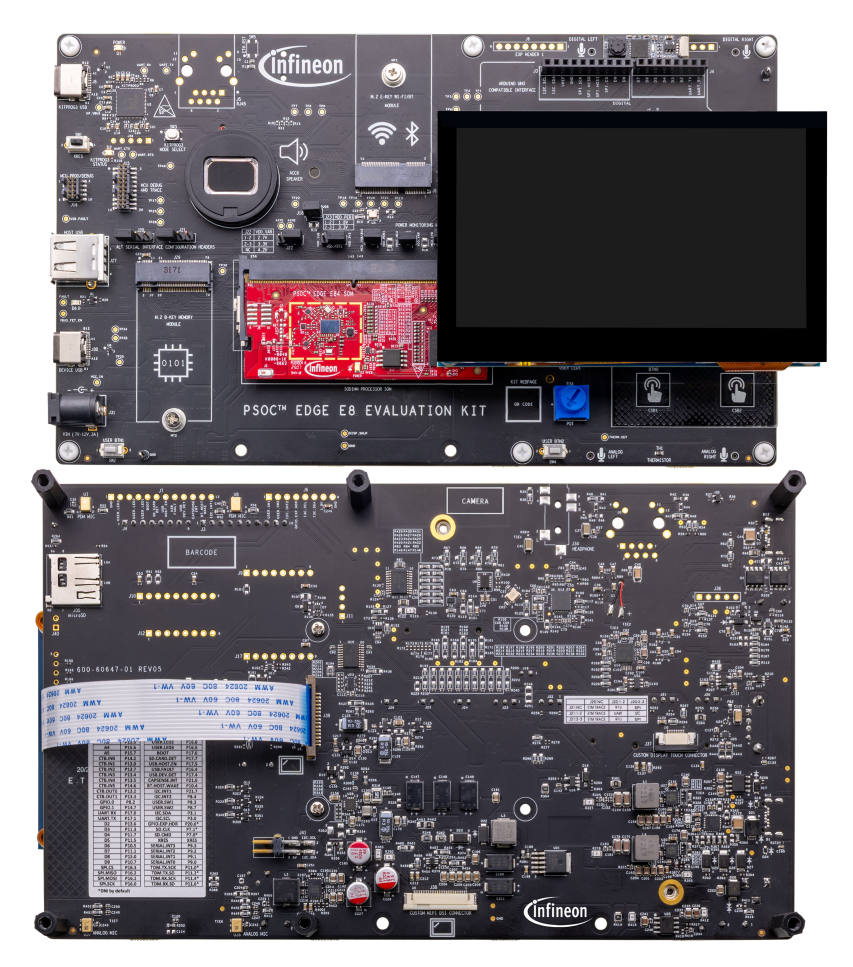
   **Figure 1.  Display connection with PSOC&trade; Edge E84 evaluation kit**

 

## Software setup

See the [ModusToolbox&trade; tools package installation guide](https://www.infineon.com/ModusToolboxInstallguide) for information about installing and configuring the tools package.

Install a terminal emulator if you do not have one. Instructions in this document use [Tera Term](https://teratermproject.github.io/index-en.html).

This example requires no additional software or tools.

## Application Specific Configurations

The following defines can be modified in the `proj_cm55/Makefile` based on the user application.

**Table 2. Application specific defines**
Project | Description
--------|------------------------
CAMERA_WIDTH | Camera width dimension
CAMERA_HEIGHT | Camera height dimension
IMAGE_WIDTH | Model input width dimension
IMAGE_HEIGHT | Model input height dimension
ENABLE_FACEID_MODEL_PROFILE | Enables model inference times to be printed over UART (includes pre and post processing times)
DRAW_HEAD_POSE_AXES | Draw head pose axes
DRAW_FACIAL_LANDMARKS | Draw facial landmarks
PLOT_ALIGNED_FACES | Plot aligned faces for debug purposes
NUM_POSES | Set number of enrolment poses. It can be set to 3, 5 and 9 poses. Default value is 5

## Operation

See [Using the code example](docs/using_the_code_example.md) for instructions on creating a project, opening it in various supported IDEs, and performing tasks, such as building, programming, and debugging the application within the respective IDEs.

1. Ensure that the 4.3-inch Raspberry-Pi TFT display and USB camera is connected to the board as per the [Display setup](#supported-display-and-electrical-connection-with-kit_pse84_eval-and-kit_pse84_ai) section

2. Connect the board to your PC using the provided USB cable through the KitProg3 USB connector

3. Open a terminal program and select the KitProg3 COM port. Set the serial port parameters to 8N1 and 115200 baud

4. Build the application

5. After programming, the application starts automatically. Verify that the UART terminal displays the output, as shown in **Figure 2**

   > **Note:** For KIT_PSE84_AI, use an external MiniProg4 to view firmware logs. See [Viewing firmware logs while web streaming is active](#viewing-firmware-logs-while-web-streaming-is-active) for wiring and setup instructions.

   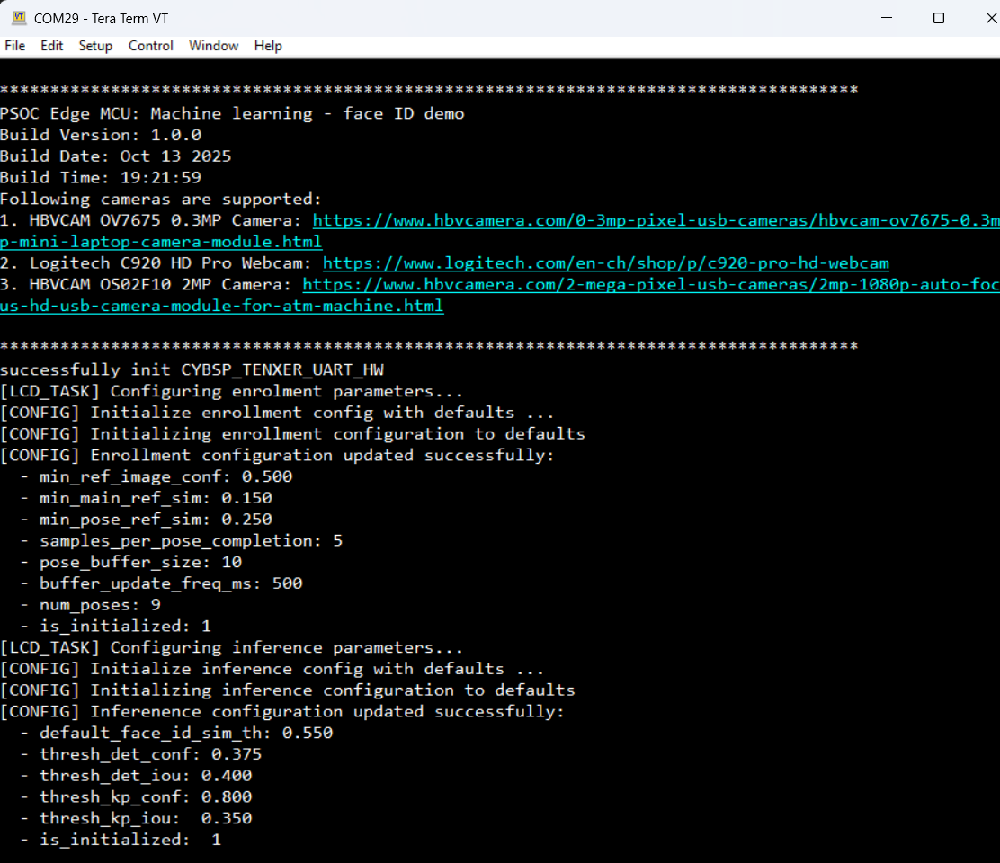
   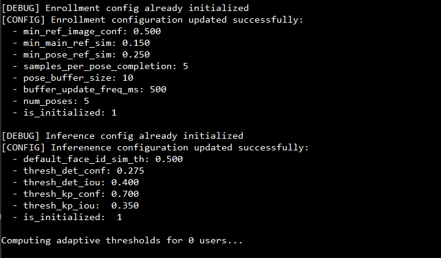
   **Figure 2. Terminal output on program startup**

6. Once the application is successfully programmed, the LCD displays the live camera feed along with the following on-device enrolment touch controls and key information:

   - **Bottom left corner:** Three action buttons – **Start Face Enrolment**, **Cancel Face Enrolment**, and **Clear Enrolled Users**
   - **Bottom right corner:**  **Model <time>** indicating FaceID mode ML inferencing time in milliseconds
   - **Upper panel:**
     - **Left:** Current mode (**INFERENCE MODE/ENROLMENT MODE**)
     - **Center:** Number of enrolled users (initially **0/5** when no user is enrolled)
   - **Face detection status:** If no user is enrolled, the detected face appears in a red box with the label **Unknown**

   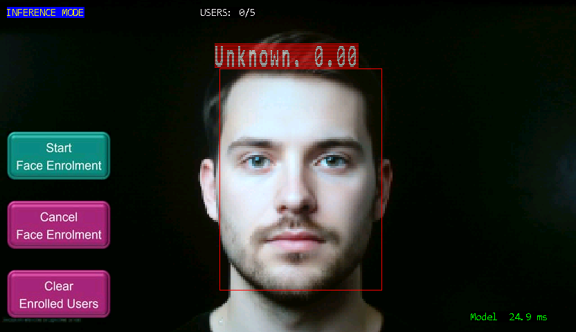
   **Figure 3. Display output after programming**

7. Upon clicking the "Start Face Enrolment" button on the display, the on-device face enrolment process begins, and the application mode transitions from **INFERENCE** to **ENROLMENT MODE**

8. Once a face is properly detected, **green** bounding box appears around the user’s face with the status **“Enrolling”** displayed in green. The **head pose progress** is shown in the bottom right corner using a color-coded legend: **orange** for not started, **pink** for in progress, and **green** for completed. Initially, all poses (up, down, front, left, right) are orange, and the status shows collecting poses and  **“Progress : 0 completed, 0 in progress”**. As poses are captured, the corresponding boxes turn pink and the status updates accordingly (e.g., if up, front, and down poses are in progress and box color becomes pink, the status shows **0 completed, 3 in progress**). When a pose is successfully completed, its box turns green and the status updates (e.g., **1 completed, 2 in progress**) and similarly all the angle should be completed

   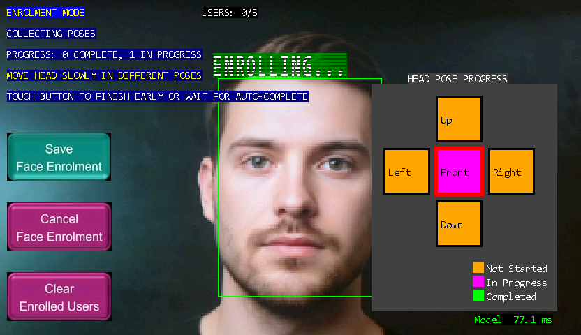
   **Figure 4. initial image of face enrolment page**

   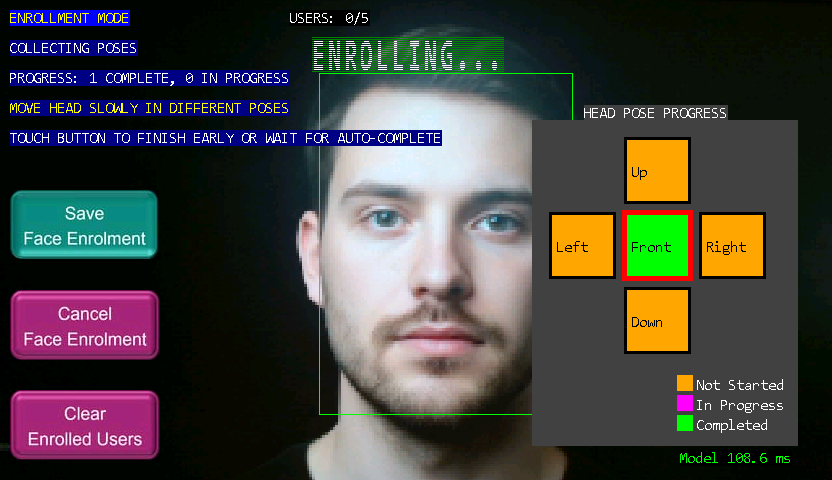
   **Figure 5. Scenario 1 : Progress: 1 completed, 0 in progress**

   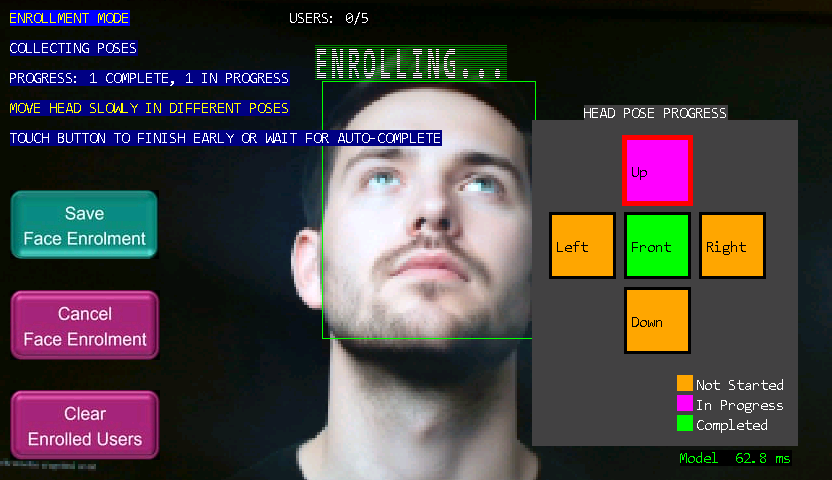
   **Figure 6. Scenario 2 : Progress: 1 completed, 1 in progress**

   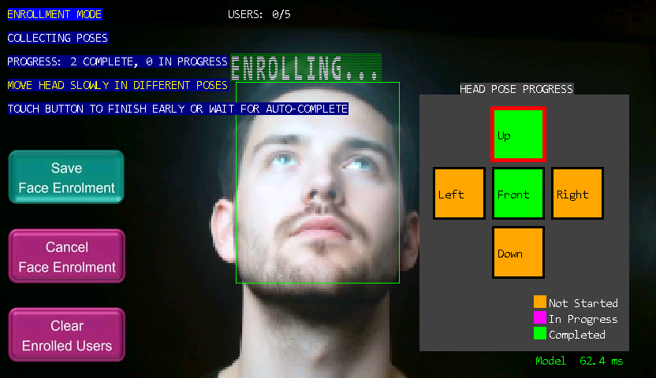
   **Figure 7. Scenario 3 : Progress: 2 completed, 0 in progress**

   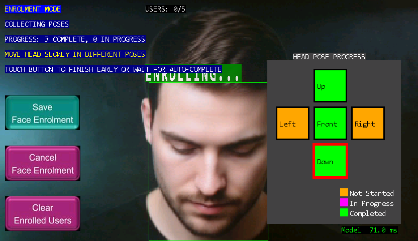
   **Figure 8. Scenario 3 : Progress: 3 completed, 0 in progress**

9. System will ask to adjust the pose if face is too close to edges, as shown in **Figure 9**

   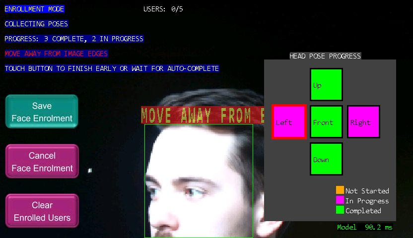
   **Figure 9. Face is too close to Edge**

10. Once all poses are captured and all the boxes turn green, the user is automatically enrolled and redirected to the inference mode and the **User** count is incremented (e.g., **1/5**). Users also have the option to save the enrolment early once minimum 3 poses are captured by pressing the **Save Face Enrolment** button on the bottom left corner, or can abort the enrolment using the **Cancel Face Enrolment** button located below it

11. After enrollment, when the same user’s face is detected within the camera’s field of view, the system draws a green bounding box around the face, labels it as "User_1," and shows the prediction count on the display

    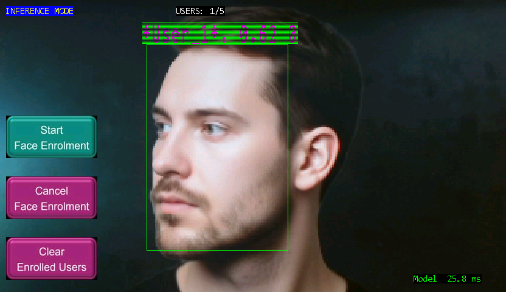
    **Figure 10. Image of enrolled user with detection**

    The terminal output after completing user enrolment should appear, as shown in  **Figure 11**

    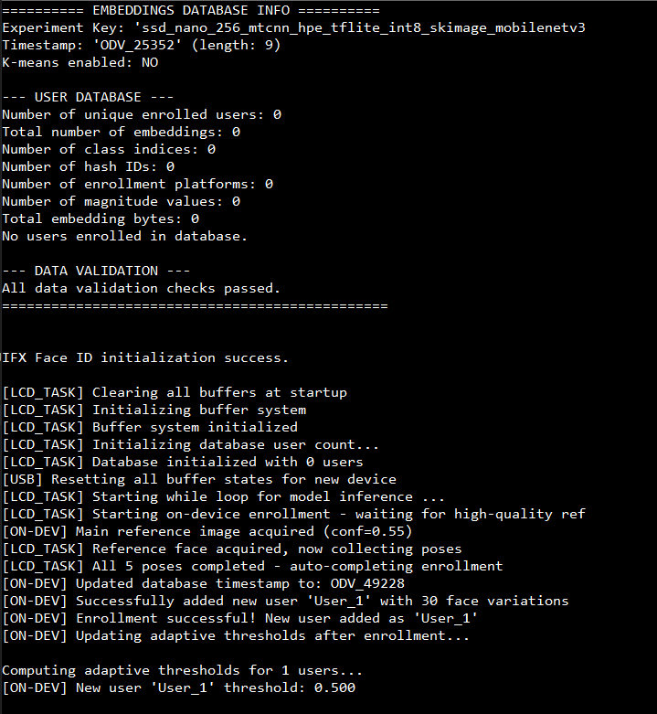
    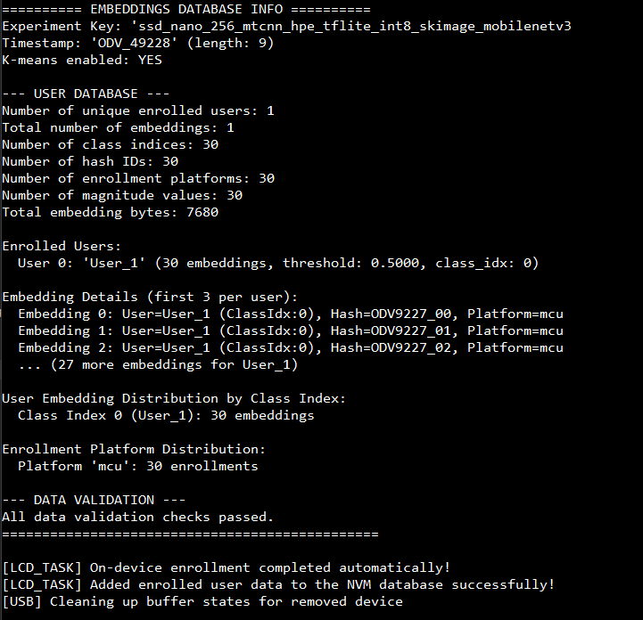

12. Up to five users can be enrolled. Whenever an enrolled face is detected, the system draws a bounding box around the face and displays the corresponding user number label (e.g., User_1 to User_5)

13. Enrollment data is stored persistently in non-volatile memory. After unplugging and plugging the kit back in, the system recognizes detected faces using the stored embeddings and draws a bounding box labeled with the corresponding user number

14. The last button, **Clear Enrolled Users**, removes all enrolled users and resets the user count and same is reflected on the upper panel

## Web streaming on KIT_PSE84_AI

The **KIT_PSE84_AI** kit supports a web streaming feature that transmits JPEG-compressed camera frames and Face ID inference metadata from the device to a host PC over UART. A self-contained HTML5 web application (`face_id_webapp_streaming.html`) receives the data via the browser's WebSerial API and provides:

- Live camera feed with real-time face detection overlays
- Color-coded bounding boxes (green = recognized user, orange = unknown)
- User labels and confidence scores
- Remote face enrollment controls (start, cancel, clear users)
- Real-time performance statistics (FPS, throughput, CRC error rate)

### Viewing firmware logs while web streaming is active

When web streaming is active, the browser WebSerial connection keeps the KitProg3 USB-UART COM port open. In this state, a serial terminal (for example Tera Term) cannot open the same COM port for firmware logs.

If log visibility is required during web streaming, use a second UART path (for example via MiniProg UART bridge) and connect it to the **KIT_PSE84_AI** kit UART header.

1. Connect **GND** (J5.6) between **KIT_PSE84_AI** kit and MiniProg.
2. Connect **KIT_PSE84_AI** kit **UART TX** (J5.3) to MiniProg **UART RX**.
3. Connect **KIT_PSE84_AI** kit **UART RX** (J5.2) to MiniProg **UART TX** (optional unless bidirectional commands are needed).
4. Connect **KIT_PSE84_AI** kit **VDD_1V8** (J5.1) to MiniProg **VTARG**.
5. Keep the normal USB connection for programming and WebSerial streaming.
6. Open the MiniProg COM port in Tera Term (or equivalent) using the firmware log UART settings (8N1, 115200 baud unless changed in firmware).

See [Web Streaming for PSOC&trade; Edge E84 AI Kit](docs/web_streaming.md) for the full feature description, protocol specification, firmware component overview, and step-by-step usage instructions.

## Related resources

Resources  | Links
-----------|----------------------------------
Application notes  | [AN235935](https://www.infineon.com/AN235935) – Getting started with PSOC&trade; Edge E84 MCU on ModusToolbox&trade; software
Code examples  | [Using ModusToolbox&trade;](https://github.com/Infineon/Code-Examples-for-ModusToolbox-Software) on GitHub
Device documentation | [PSOC&trade; Edge MCU datasheets](https://www.infineon.com/products/microcontroller/32-bit-psoc-arm-cortex/32-bit-psoc-edge-arm#documents)   [PSOC&trade; Edge MCU reference manuals](https://www.infineon.com/products/microcontroller/32-bit-psoc-arm-cortex/32-bit-psoc-edge-arm#documents)
Development kits | Select your kits from the [Evaluation board finder](https://www.infineon.com/cms/en/design-support/finder-selection-tools/product-finder/evaluation-board)
Libraries  | [mtb-dsl-pse8xxgp](https://github.com/Infineon/mtb-dsl-pse8xxgp) – Device support library for PSE8XXGP   [retarget-io](https://github.com/Infineon/retarget-io) – Utility library to retarget STDIO messages to a UART port
Tools  | [ModusToolbox&trade;](https://www.infineon.com/modustoolbox) – ModusToolbox&trade; software is a collection of easy-to-use libraries and tools enabling rapid development with Infineon MCUs for applications ranging from wireless and cloud-connected systems, edge AI/ML, embedded sense and control, to wired USB connectivity using PSOC&trade; Industrial/IoT MCUs, AIROC&trade; Wi-Fi and Bluetooth&reg; connectivity devices, XMC&trade; Industrial MCUs, and EZ-USB&trade;/EZ-PD&trade; wired connectivity controllers. ModusToolbox&trade; incorporates a comprehensive set of BSPs, HAL, libraries, configuration tools, and provides support for industry-standard IDEs to fast-track your embedded application development

 

## Other resources

Infineon provides a wealth of data at [www.infineon.com](https://www.infineon.com) to help you select the right device, and quickly and effectively integrate it into your design.

## Document history

Document title: *CE242187* – *PSOC&trade; Edge MCU: Machine learning - face ID demo*

 Version | Description of change
 ------- | ---------------------
 1.0.0   | GitHub release
 1.1.0   | Updated design files to fix ModusToolbox&trade; v3.7 build warnings
 1.2.0   | Added web streaming functionality for KIT_PSE84_AI
 

All referenced product or service names and trademarks are the property of their respective owners.

The Bluetooth&reg; word mark and logos are registered trademarks owned by Bluetooth SIG, Inc., and any use of such marks by Infineon is under license.

PSOC&trade;, formerly known as PSoC&trade;, is a trademark of Infineon Technologies. Any references to PSoC&trade; in this document or others shall be deemed to refer to PSOC&trade;.

---------------------------------------------------------

(c) 2026, Infineon Technologies AG, or an affiliate of Infineon Technologies AG. All rights reserved.
This software, associated documentation and materials ("Software") is owned by Infineon Technologies AG or one of its affiliates ("Infineon") and is protected by and subject to worldwide patent protection, worldwide copyright laws, and international treaty provisions. Therefore, you may use this Software only as provided in the license agreement accompanying the software package from which you obtained this Software. If no license agreement applies, then any use, reproduction, modification, translation, or compilation of this Software is prohibited without the express written permission of Infineon.
 
Disclaimer: UNLESS OTHERWISE EXPRESSLY AGREED WITH INFINEON, THIS SOFTWARE IS PROVIDED AS-IS, WITH NO WARRANTY OF ANY KIND, EXPRESS OR IMPLIED, INCLUDING, BUT NOT LIMITED TO, ALL WARRANTIES OF NON-INFRINGEMENT OF THIRD-PARTY RIGHTS AND IMPLIED WARRANTIES SUCH AS WARRANTIES OF FITNESS FOR A SPECIFIC USE/PURPOSE OR MERCHANTABILITY. Infineon reserves the right to make changes to the Software without notice. You are responsible for properly designing, programming, and testing the functionality and safety of your intended application of the Software, as well as complying with any legal requirements related to its use. Infineon does not guarantee that the Software will be free from intrusion, data theft or loss, or other breaches (“Security Breaches”), and Infineon shall have no liability arising out of any Security Breaches. Unless otherwise explicitly approved by Infineon, the Software may not be used in any application where a failure of the Product or any consequences of the use thereof can reasonably be expected to result in personal injury.
