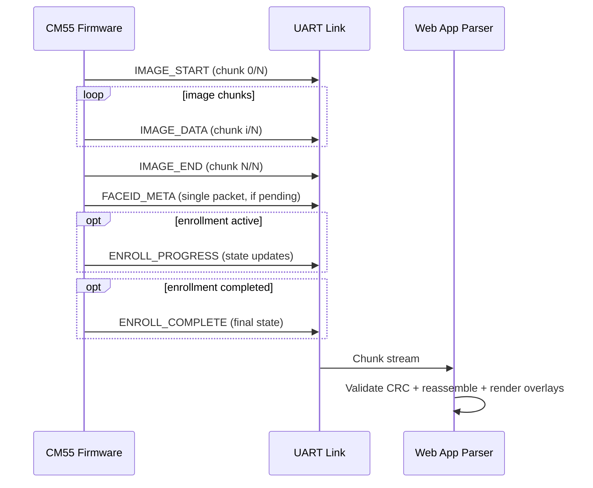
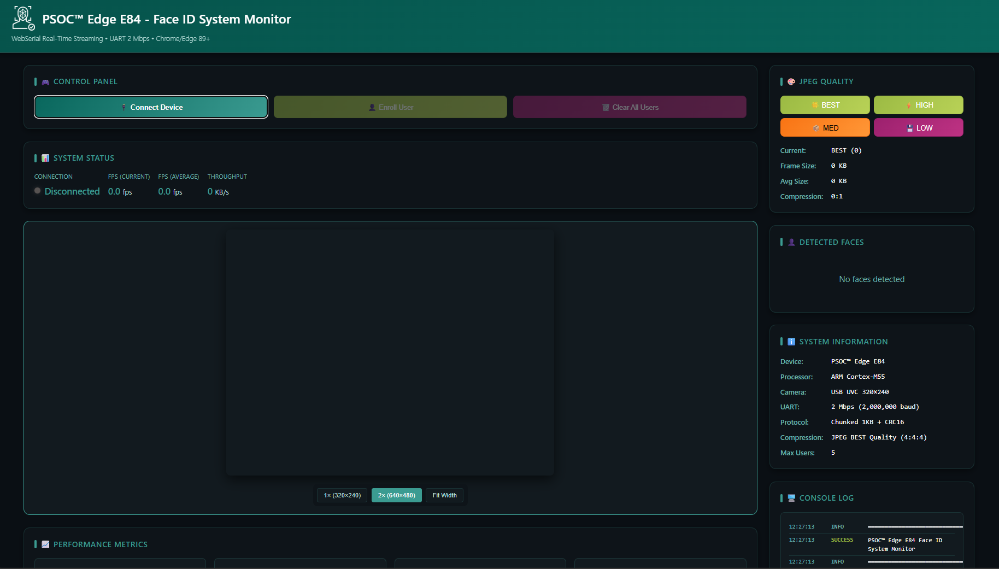
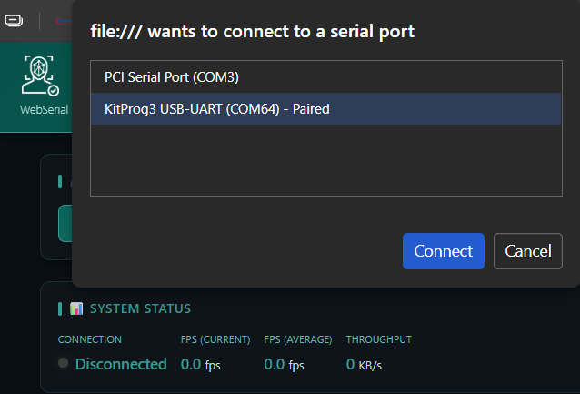
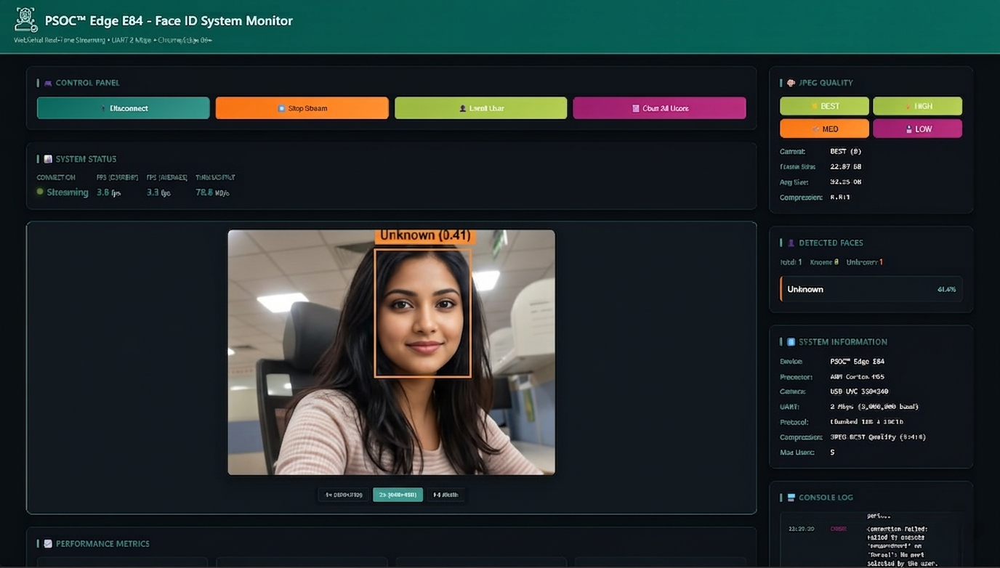
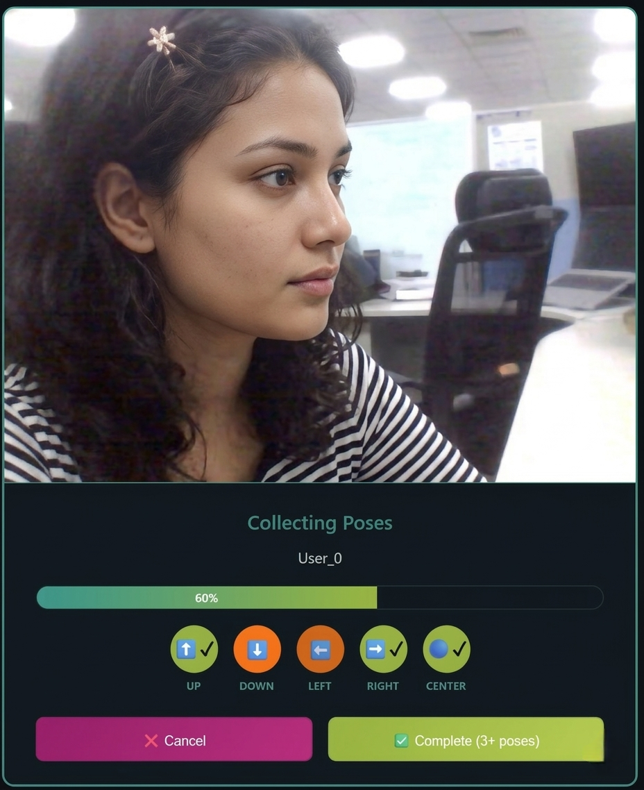
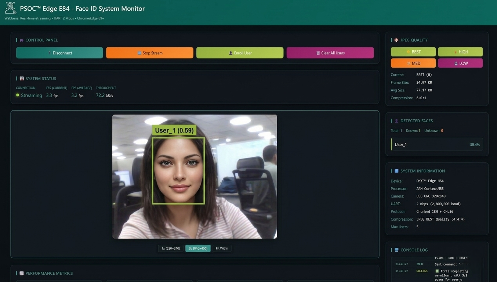

[Click here](../README.md) to view the README.

# Web Streaming for PSOC&trade; Edge E84 AI kit

This document describes the **web streaming feature** added to the face ID code example, which is available for the **KIT_PSE84_AI** kit. It covers the system architecture, protocol specification, hardware requirements, and step-by-step usage instructions for streaming live face ID video and metadata from the device to a browser-based web application.


## Table of Contents

1. [Overview](#overview)
2. [Supported kit](#supported-kit)
3. [System architecture](#system-architecture)
4. [Chunked streaming protocol](#chunked-streaming-protocol)
5. [Firmware components](#firmware-components)
6. [Web application](#web-application)
7. [Getting started](#getting-started)
8. [Web App features](#web-app-features)
9. [Enrollment via web app](#enrollment-via-web-app)
10. [Performance characteristics](#performance-characteristics)
11. [Troubleshooting](#troubleshooting)


## Overview

The web streaming path sends JPEG-compressed camera frames and Face ID metadata from CM55 firmware to a host PC over UART. The host-side web app receives chunked packets over WebSerial, validates CRC per chunk, reconstructs frames, and renders overlays and enrollment UI.

Main capabilities:
- Live video with recognized/unknown overlays
- Per-frame face metadata (bbox, user, confidence)
- Enrollment progress telemetry and completion status
- Streaming telemetry (FPS, throughput, CRC errors)


## Supported Kit

The web streaming feature is supported on and specifically intended for the:

**[PSOC&trade; Edge E84 AI Kit](https://www.infineon.com/KIT_PSE84_AI)** (`KIT_PSE84_AI`)

> **Note:** The USB Host on KIT_PSE84_AI is a Type-C connector. A Type-A to Type-C converter is required to connect the USB camera. The UART debug connector on this kit exposes the USB-to-UART bridge used by the web streaming feature.


## System Architecture

The web streaming pipeline spans two layers: firmware running on the PSOC&trade; Edge CM55 core and a browser-based host application.

```text
+----------------------------------------------------------------------------------+
|                      PSOC Edge E84 (CM55 Firmware)                                |
|                                                                                   |
|  +------------------+      +--------------------+      +----------------------+   |
|  | USB Camera       |----->| Face ID Inference  |----->| Face Metadata        |   |
|  | 320 x 240 (UVC)  |      +--------------------+      +----------------------+   |
|  |                  |                 |                        |                  |
|  |                  |                 |                        v                  |
|  |                  |      +--------------------+      +----------------------+   |
|  +------------------+----->| JPEG Encoder       |----->| Chunked Stream       |   |
|                            | (RGB565 -> JPEG)   |      | Manager              |   |
|                            +--------------------+      | - 1 KB payloads      |   |
|                                      ^                 | - CRC16-CCITT        |   |
|                                      |                 | - sequence + type    |   |
|                            +--------------------+      +----------+-----------+   |
|                            | Enrollment Progress|------------------|              |
|                            +--------------------+                  |              |
|                                                                     v             |
|                                                           +--------------------+  |
|                                                           | UART               |  |
|                                                           | 2,000,000 bps      |  |
|                                                           +---------+----------+  |
+----------------------------------------------------------------------------------+
                                      |
                                      | USB serial
                                      v
+----------------------------------------------------------------------------------+
|                                Host PC / Web App                                 |
|                                                                                  |
|  +------------------+   +--------------------+   +----------------------------+  |
|  | WebSerial Reader |-->| Chunk Parser       |-->| Image Reassembly           |  |
|  |                  |   | magic/type/seq/CRC |   | + Metadata + Enrollment    |  |
|  +------------------+   +--------------------+   +-------------+--------------+  |
|                                                              |                   |
|                                                              v                   |
|                                                    +-------------------------+   |
|                                                    | Canvas Renderer         |   |
|                                                    | overlays + telemetry    |   |
|                                                    +-------------------------+   |
+----------------------------------------------------------------------------------+
```


## Chunked Streaming Protocol

The firmware transmits variable-length payloads in fixed-size chunk envelopes. Each chunk has a 12-byte header followed by up to 1024 bytes of payload.

### Packet Header (12 bytes)

```c
typedef struct __attribute__((packed)) {
    uint8_t  magic[2];       // 0xAB 0xCD
    uint8_t  type;           // CHUNK_TYPE_*
    uint8_t  sequence;       // Frame sequence (1..255 wrap)
    uint16_t chunk_id;       // 0-based index in frame
    uint16_t total_chunks;   // Total chunks for this frame
    uint16_t payload_size;   // <= 1024
    uint16_t crc16;          // CRC16-CCITT of payload only
} chunk_header_t;
```

### Chunk Types

| Value | Symbol | Description |
|------:|--------|-------------|
| `0x01` | `CHUNK_TYPE_IMAGE_START` | First chunk of image frame |
| `0x02` | `CHUNK_TYPE_IMAGE_DATA` | Middle image chunk |
| `0x03` | `CHUNK_TYPE_IMAGE_END` | Last image chunk |
| `0x04` | `CHUNK_TYPE_FACEID_META` | Face detection/recognition metadata |
| `0x05` | `CHUNK_TYPE_HEARTBEAT` | Keepalive (reserved/optional) |
| `0x06` | `CHUNK_TYPE_ENROLL_PROGRESS` | Enrollment progress update |
| `0x07` | `CHUNK_TYPE_ENROLL_COMPLETE` | Enrollment completion notification |

### Face Metadata Payload

```c
typedef struct __attribute__((packed)) {
    int16_t  bbox_x1;
    int16_t  bbox_y1;
    int16_t  bbox_x2;
    int16_t  bbox_y2;
    int16_t  user_id;        // -1 unknown, >=0 recognized
    uint16_t confidence;     // confidence * 1000
    char     user_name[16];
} faceid_face_info_t;

typedef struct __attribute__((packed)) {
    uint8_t  num_faces;      // 0..4
    uint8_t  reserved[3];
    faceid_face_info_t faces[4];
} faceid_metadata_payload_t;
```

### Enrollment Payload

```c
typedef struct __attribute__((packed)) {
    uint8_t  state;             // 0 none, 1 waiting, 2 collecting, 3 completing, 4 completed
    uint8_t  current_pose;      // 0..4
    uint8_t  total_poses;       // typically 5
    uint8_t  progress_percent;  // 0..100
    uint8_t  pose_progress[5];  // per-pose 0..100
    char     user_name[16];
} enrollment_progress_payload_t;
```

### UART Link Parameters

| Parameter | Value |
|-----------|-------|
| Baud rate | 2,000,000 bps |
| Data bits | 8 |
| Stop bits | 1 |
| Parity | None |
| Flow control | None |
| Chunk payload size | 1024 bytes |

### Runtime Packet Sequence




## Firmware Components

The following files in `proj_cm55/web_streaming` implement the streaming pipeline:

| File | Description |
|------|-------------|
| `proj_cm55/web_streaming/chunked_stream.h` | Public protocol constants, payload structs, and API declarations |
| `proj_cm55/web_streaming/chunked_stream.c` | JPEG chunking, UART packet emission, CRC16 helper APIs, frame/progress state |
| `proj_cm55/web_streaming/jpeg_encoder.cpp/.h` | JPEG compression used by streaming path |
| `proj_cm55/web_streaming/uart_protocol.h` | Legacy flat-frame helper API and status constants |
| `proj_cm55/web_streaming/uart_protocol.c` | Implementation split from header (encode/decode/CRC helpers) |
| `proj_cm55/lcd_task.c` | Produces RGB565 frames and pushes metadata/enrollment progress |
| `proj_cm55/oob_uart_cmd.c` | UART task that drives stream processing and app control integration |

### Key API Functions

```c
void chunked_stream_init(void);
void chunked_stream_start(void);
void chunked_stream_stop(void);
bool chunked_stream_is_active(void);

bool chunked_stream_push_frame(const uint16_t *rgb565);
bool chunked_stream_push_faceid(uint8_t num_faces, const faceid_face_info_t *faces);
bool chunked_stream_push_enrollment_progress(uint8_t state,
                                             uint8_t current_pose,
                                             uint8_t total_poses,
                                             uint8_t progress_percent,
                                             const uint8_t *pose_progress,
                                             const char *user_name);

void chunked_stream_process(void);
```


## Web Application

The web application is a single self-contained HTML5 file:
- `proj_cm55/web_streaming/face_id_web_streaming.html`

Behavior summary:
- Opens serial port and reads continuous chunk stream
- Validates each chunk with CRC16 and sequence information
- Reconstructs JPEG frames for canvas rendering
- Renders face overlays and enrollment progress/status
- Displays throughput/FPS/error telemetry

> **Note:** During active web streaming, the browser holds the KitProg3 USB-UART COM port, so a serial terminal cannot read firmware logs from the same port at the same time. For an alternate two-UART logging setup (for example, using MiniProg), see [README.md](../README.md#viewing-firmware-logs-while-web-streaming-is-active).


## Getting Started

### Prerequisites

1. PSOC&trade; Edge E84 AI Kit (`KIT_PSE84_AI`) with USB camera connected to J2
2. USB connection from host PC to board debug/UART interface
3. Firmware built and programmed for KIT_PSE84_AI target

### Step 1: Build and Program the Firmware

Build and program all three sub-projects in sequence using ModusToolbox&trade;:

```bash
# From the workspace root
make build TOOLCHAIN=GCC_ARM CONFIG=Debug
make program
```

Alternatively, use the **Build Application** task in VS Code (ModusToolbox&trade; extension).

### Step 2: Open the Web Application

1. Open `proj_cm55/web_streaming/face_id_web_streaming.html` in a Chromium-based browser (Chrome or Edge).

    **Figure 1. Landing page on first browser open (disconnected state)**

    

2. Click **Connect Device** and select the **KitProg3 USB-UART** COM port from the browser's serial port picker.

    **Figure 2. Connect Device serial port picker (select KitProg3 USB-UART COM port)**

    

3. Click **Start Streaming**. The live camera feed appears with a bounding box and **Unknown** label for any detected face that has not yet been enrolled.

    **Figure 3. Live streaming view with Unknown face detection**

    


## Web App Features

### Live Video Feed

- Camera native resolution: **320 × 240** pixels
- JPEG compressed at quality 85 to ~6–7 KB per frame
- Rendered on an HTML5 `<canvas>` element with pixel-accurate scaling

### Face Detection Overlays

| Visual Element | Meaning |
|----------------|---------|
| Green bounding box (3 px) | Recognised and enrolled user |
| Orange bounding box (2 px) | Unknown face detected |
| Numbered badge (#1–#4) | Face index in current frame |
| User label | Format: `User_N (confidence)` e.g., `User_1 (0.87)` |
| Statistics panel (top-right) | Live count: Total / Known / Unknown faces |

### Enrollment UX

- Start enrollment from UI
- Live per-pose progress and overall percentage
- Completion status updates when enrollment finalizes
- Cancel/clear actions available from UI controls

### Telemetry

- Total frames
- CRC errors
- Throughput (KB/s)
- Average FPS


## Enrollment via Web App

The web application supports remote face enrollment without requiring any physical button press on the board.

| State | Meaning |
|------:|---------|
| `0` | None / idle |
| `1` | Waiting for reference pose |
| `2` | Collecting poses |
| `3` | Completing enrollment |
| `4` | Completed |

### Enrollment Workflow


1. User clicks **Enroll User** in the web app UI.
2. Reference pose is acquired.
3. Pose collection proceeds until all required poses are complete.

    **Figure 4. Enrollment in progress with pose collection overlay**

    

4. Completion packet is emitted and the UI reflects success. The previously unknown face is now recognized with its assigned user name.

    **Figure 5. Post-enrollment recognition of same face as User 1**

    


## Performance Characteristics

Typical observed values on KIT_PSE84_AI:

| Parameter | Typical Value |
|-----------|---------------|
| JPEG encode time | ~30 ms |
| UART transmission time | ~20-30 ms |
| Face ID inference time | ~25 ms |
| End-to-end latency | < 150 ms |
| Effective streaming FPS | 8-9 fps |
| Chunk payload size | 1024 bytes |
| Typical JPEG frame size | 6-7 KB |
| CRC error rate (good cable) | < 2% |

Note:
- Effective FPS is constrained by combined JPEG + UART transfer time.


## Troubleshooting

### No stream displayed

- Verify firmware was programmed for KIT_PSE84_AI.
- Confirm the web app is connected to the correct COM port.
- Ensure streaming has been started in the UI.

### Frame corruption or frequent CRC errors

- Use a short, high-quality USB cable.
- Avoid USB hubs where possible.
- Confirm UART speed remains fixed at 2,000,000 bps in firmware and host parsing path.

### Low FPS

- Check host CPU load and browser tab throttling.
- Reduce visual scaling load in the web UI.
- Keep only one active serial consumer on the COM port.
